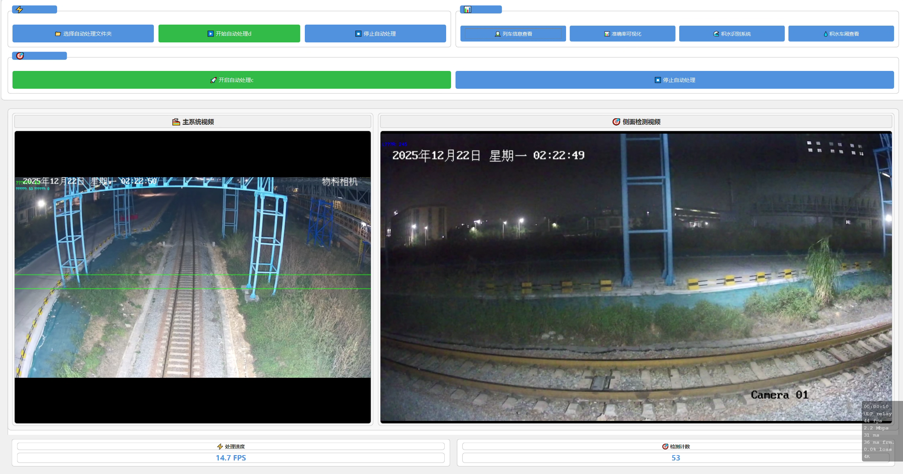
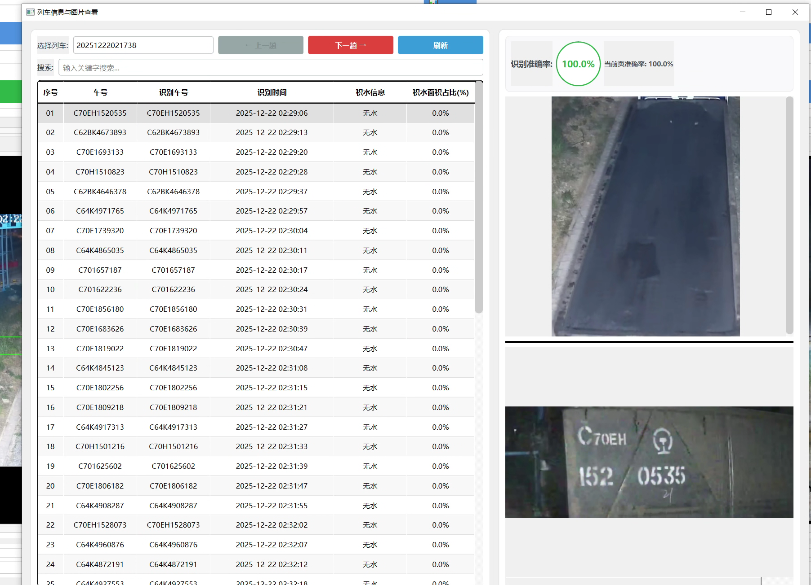

# 积水检测系统

## 一、项目简介

本项目为 **厂区列车积水检测与车厢监测系统**，主要面向现场运营人员和后台运维人员，基于视频智能识别技术，实现：

- 列车经过厂区时的 **积水风险自动检测与预警**；
- 列车车厢（含侧面）目标检测与计数；
- 处理结果（图片 / 车厢信息 / 积水记录）自动保存与可视化；
- 与后台数据库联动，支持积水车厢审核、状态更新与统计分析；
- 支持多线程自动扫描新视频，**无人值守地持续处理新数据**。

桌面端界面基于 PySide6（Qt）实现，入口为 `guanggang_main.py` 中的 `MainWindow` 主窗体，窗口标题为：

> 广钢积水检测系统 v5.0

## 二、主要功能模块概览

### 1. 主系统视频检测（正面 / 车厢通过计数）

对应类：`VideoThread` + `MainWindow` 中主系统相关控件。

- 自动从视频中识别通过画面的列车 / 车厢目标。
- 在画面中绘制检测框、计数区域（两条横线）等辅助线。
- 在指定计数区域内，对通过的目标进行计数：
  - 在 `count_line_top` 与 `count_line_bottom` 之间的目标计为有效；
  - 默认假设列车单向通过，同一 ID 不会重复计数。
- 将检测到的目标区域 **裁剪为小图** 保存到 `runs/output_images/<视频父目录>/frame_xxx.jpg`。
- 自动写入处理完成标记 `processed_complete.txt`，避免重复处理同一视频。
- 通过 UI 中的 **处理速度 / 检测计数卡片** 实时展示：
  - 当前视频处理 FPS；
  - 已检测目标数量及方向统计。

### 2. 侧面检测系统（Cemian 系统）

对应类：`CemianVideoThread` 与 `MainWindow` 中“🎯 侧面检测系统”区域。

- 面向列车 **侧面视角** 的检测和计数，支持：
  - 从右往左 / 从左往右的方向计数；
  - 不同检测线（line1 / line2）的通过次数；
  - 支持车牌识别模型，输出车牌结果 CSV。
- 自动按父文件夹划分结果目录 `output_images/<视频父目录>/`：
  - 保存检测帧图片；
  - 保存 `plate_results.csv` 等统计文件。
- 通过 “🚀 开启自动处理c / ⏹️ 停止自动处理” 一键启动 / 停止侧面自动处理线程。

### 3. 自动视频扫描与处理调度

对应类：`AutoProcessor` + `VideoThread`。

- 自动扫描指定目录（默认：`E:\积水识别项目\视频下载模块\record`）下的视频：
  - 主系统视频：文件名以 `36` 开头的 `.mp4`；
  - 侧面系统视频：文件名以 `33` 开头的 `.mp4/.avi`。
- 仅处理 **最近一周内** 的新视频，避免反复扫历史数据。
- 判断视频是否已处理：
  - 通过输出目录是否存在；
  - 是否存在 `processed_complete.txt` 或已导出的图片；
  - 对于侧面系统，还检查 `plate_results.csv` 是否存在且非空。
- 主界面通过按钮：
  - “📁 选择自动处理文件夹”
  - “▶️ 开始自动处理d”
  - “⏹️ 停止自动处理”
  来管理自动处理任务。

### 4. 积水识别系统与结果浏览

在 `MainWindow` 中，提供若干入口按钮：

- **🌊 积水识别系统**：
  - 使用单独的积水分割模型 `WATER_SEGMENT_WEIGHTS`；
  - 针对 `runs/output_images` 中的结果图像进行积水区域识别；
  - 将识别结果写入特定目录 `water_detection_status` 及数据文件中；
  - 周期性扫描新结果，形成近实时的积水情况更新。

- **💧 积水车厢查看**：
  - 使用 `test_mysql.py` 中的 MySQL 查询函数：
    - `query_recent_water_carriages`
    - `review_mark_no_water`
    - `review_confirm_water`
  - 支持查看近期被识别为存在积水风险的车厢；
  - 支持人工审核：标记“无积水”或“确认积水”，同步更新数据库；
  - 与缓存管理联动，修改审核结果后，可以自动清除 / 刷新相关列车的缓存。

- **🚆 列车信息查看**：
  - 查看单列车的各车厢检测结果、图片及积水状态等信息；
  - 内部配有缓存管理，以减少重复读 CSV 和重复渲染。

- **📊 准确率可视化**（可选）：
  - 入口为 `accuracy_visualization.py` 中的 `TrainAccuracyMainWindow`；
  - 若模块存在，则可查看模型离线训练/验证的准确率曲线等指标。

### 5. 数据库自动更新器

对应模块：`DatabaseAutoUpdater`（在 `guanggang_main.py` 中导入）。

- 以后台线程形式 **定期检查并更新数据库**；
- 默认轮询周期为 30 秒：`DatabaseAutoUpdater(check_interval=30)`；
- 在 UI 初始化完成后，通过 `QTimer.singleShot(0, ...)` 延迟启动，避免阻塞界面加载；
- 确保积水检测结果、审核结果与数据库保持同步。

## 三、技术栈说明

### 1. 编程语言与运行环境

- **Python 3.x**（建议 3.8+，需与 `ultralytics`、`PySide6` 等版本兼容）。
- 操作系统：以 **Windows** 为主要运行环境（代码中大量使用 Windows 路径和 `os.startfile` 等）。

### 2. 核心第三方库

- **GUI / 桌面应用**：
  - `PySide6`：Qt 6 的 Python 绑定，用于构建主窗口、按钮、表格、对话框等。

- **深度学习 / 目标检测**：
  - `ultralytics` 中的 `YOLO`：
    - 主系统：车辆/车厢检测与跟踪（`model.track`）。
    - 侧面系统：侧面车厢与车牌识别。
  - 模型权重（需要本地存在）：
    - `SEGMENT_TRAIN2_WEIGHTS`: `runs/segment/train2/weights/best.pt`
    - `WATER_SEGMENT_WEIGHTS`: `runs/segment/train/weights_jishui/best4.pt`
    - `DETECT_TRAIN5_WEIGHTS`: `runs/detect/train5/weights/best.pt`
    - `DETECT_TRAIN2_PLATE_WEIGHTS`: `runs/detect/train2/weights/best3_0816.pt`

- **图像 / 数值处理**：
  - `opencv-python (cv2)`：视频解码、图像绘制、裁剪和保存；
  - `numpy`：数值计算，数组操作；
  - `Pillow (PIL.Image)`（延迟导入）：图像读写与处理；
  - `matplotlib`、`seaborn`：可视化与图表绘制；

- **数据处理与可视化**：
  - `pandas`：读取/写入 CSV、数据清洗与统计；
  - `tqdm`：处理进度条显示；

- **系统与监控相关**：
  - `watchdog`：文件系统监听，新文件创建 / 修改事件响应；
  - `threading` / `QThread`：多线程处理视频与监控任务；
  - `MySQL` 相关驱动（在 `test_mysql.py` 中使用，如 `pymysql` 或 `mysql-connector-python`，需根据你的实现安装）。

## 四、项目目录与关键路径

> 以下为代码中写死的默认绝对路径，仅供理解逻辑使用，**实际部署时建议在配置文件或环境变量中重新指定**。

- 输出图片目录：
  - `OUTPUT_IMAGES_DIR = E:\积水识别项目\demo0625\demo\output_images`
  - `RUNS_OUTPUT_IMAGES_DIR = E:\积水识别项目\demo0625\demo\runs\output_images`

- 数据与状态目录：
  - `DATA_DIR = E:\积水识别项目\demo0625\demo\data`
  - `WATER_STATUS_DIR = E:\积水识别项目\demo0625\demo\water_detection_status`
  - `PROCESSED_FILES_PATH = E:\积水识别项目\demo0625\demo\已处理文件记录.txt`

- 模型权重路径：
  - `SEGMENT_TRAIN2_WEIGHTS`
  - `WATER_SEGMENT_WEIGHTS`
  - `DETECT_TRAIN5_WEIGHTS`
  - `DETECT_TRAIN2_PLATE_WEIGHTS`

- 视频源目录（下载模块输出）：
  - 主系统 & 侧面系统默认均指向：
    - `E:\积水识别项目\视频下载模块\record`
  - 主系统自动处理：文件名以 `36` 开头的 `.mp4`；
  - 侧面系统自动处理：文件名以 `33` 开头的 `.mp4`/`.avi`。

## 五、环境准备与依赖安装

### 1. 建议的核心依赖（示例）

请根据你本地的 `requirements.txt` 或环境为准，下方为典型依赖列表示意：

```bash
pip install \
  pyqt6 PySide6 \
  opencv-python \
  ultralytics \
  numpy pandas matplotlib seaborn \
  watchdog tqdm pillow \
  pymysql  # 或其它 MySQL 驱动
```

> 注意：`ultralytics` 版本需与权重文件训练时使用的版本兼容。

### 2. 模型权重与路径

- 确保上述 4 个 `*.pt` 模型权重已经放置在代码中指定位置；
- 若目录结构发生变化，请修改 `guanggang_main.py` 顶部常量中的绝对路径；
- 若要改为相对路径或通过配置文件加载路径，也建议集中在一个模块里维护。

### 3. 数据库与配置

- 在 `test_mysql.py` 中配置 MySQL 连接信息（主机、端口、用户名、密码、数据库名等）；
- 确保有对应的表结构支持：
  - 积水车厢记录表；
  - 审核记录表；
  - 其他统计表（如有）。

## 六、运行方式

### 1. 启动主界面

在 Windows 环境中，进入项目根目录，执行：

```bash
python guanggang_main.py
```

启动后将弹出主窗口：**中国移动-广钢积水检测v5.0**。

### 2. 常用操作步骤示例

#### 2.1 配置自动处理目录

1. 在主界面上，点击 **“📁 选择自动处理文件夹”**；
2. 选择实际存放视频的目录（例如下载模块的 `record` 目录）；
3. 系统会在该目录下递归查找符合命名规则的视频文件。

#### 2.2 启动主系统批量处理

1. 在主界面上点击 **“▶️ 开始自动处理d”**；
2. 系统会启动 `AutoProcessor` 线程，定期扫描新视频：
   - 对于每个未处理的 `36*.mp4`：
     - 调用 `VideoThread` 执行检测 / 跟踪 / 计数；
     - 在 UI 左侧“🏭 主系统视频”区域展示实时画面；
     - 保存裁剪后的小车厢图片到 `runs/output_images/<父目录>`；
     - 生成 `processed_complete.txt` 标记文件。
3. 若需要停止，点击 **“⏹️ 停止自动处理”** 即可。

#### 2.3 启动侧面检测系统自动处理

1. 在主界面“🎯 侧面检测系统”区域：
   - 点击 **“🚀 开启自动处理c”**，侧面线程开始工作；
   - 右侧“🎯 侧面检测视频”区域将显示侧面检测画面；
2. 系统自动处理 `33*.mp4`/`.avi` 视频：
   - 保存检测帧图片到 `output_images/<父目录>`；
   - 输出 `plate_results.csv` 等统计文件；
   - 通过信号更新侧面计数信息（包括左右方向与不同检测线）。
3. 点击 **“⏹️ 停止自动处理”** 可结束侧面自动处理。

#### 2.4 查看检测结果与积水车厢

- 点击 **“🚆 列车信息查看”**：
  - 选择具体列车，查看该列车各车厢的检测结果与图片；
- 点击 **“🌊 积水识别系统”**：
  - 打开积水识别子系统界面，对已生成的图片进行积水区域识别；
- 点击 **“💧 积水车厢查看”**：
  - 通过与数据库联动，查看近期识别出的积水车厢列表；
  - 在界面中对单个车厢做“无积水 / 确认积水”审核操作；
  - 系统会自动刷新缓存与列表显示。

#### 2.5 准确率可视化（可选）

- 若项目目录中存在 `accuracy_visualization.py` 且导入成功：
  - 点击 **“📊 准确率可视化”** 按钮；
  - 打开模型训练准确率可视化界面，查看历史训练曲线。

## 七、注意事项与常见问题

- **路径硬编码问题**：
  - 当前代码中大量使用 `E:\积水识别项目\...` 绝对路径；
  - 若在其他机器或路径下部署，需要统一修改这些常量；
  - 建议将路径集中抽到配置文件（如 `config.json` 或 `.ini`）。

- **模型加载失败**：
  - 确认权重 `*.pt` 文件存在且路径正确；
  - 版本不兼容时，可尝试使用训练时的 `ultralytics` 版本；
  - 终端中会有 `加载模型失败` 等提示信息。

- **MySQL 连接问题**：
  - 若启动时报 `导入 test_mysql 失败`，说明数据库模块缺失或配置错误；
  - 可先确认是否已安装对应 MySQL 驱动，并检查连接配置。

- **显存 / 内存压力**：
  - `VideoThread` 内部有垃圾回收与帧数控制逻辑，但在高分辨率视频下仍可能较吃资源；
  - 可适当调低视频分辨率或处理频率，或在更高算力设备上部署。

- **UI 无响应 / 卡顿**：
  - 主要计算任务均在 `QThread` 中执行，但若在主线程中做大量 IO 或计算，也可能造成卡顿；
  - 调试时可通过增加日志和缩小处理规模来定位问题点。

## 八、二次开发建议

- 抽离路径配置到独立模块或配置文件，支持多环境切换；
- 通过命令行参数或配置中心区分：测试 / 生产环境；
- 使用日志框架（如 `logging`）替代 `print`，统一管理日志级别与输出；
- 为核心检测 / 积水识别 / 数据库接口编写单元测试，便于维护与回归；
- 在前端增加运行状态面板（线程状态、队列长度、数据库连接状态等），提升运维可 observability。



